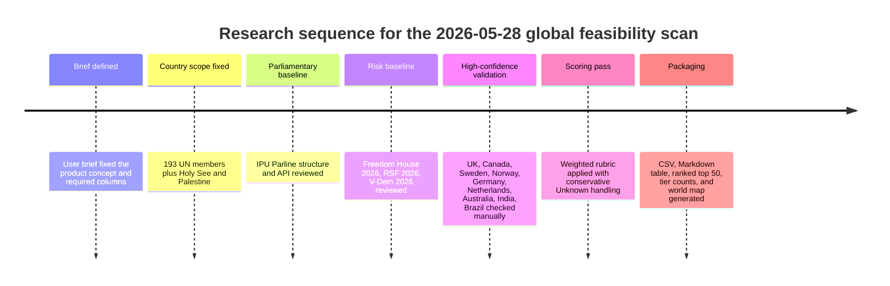
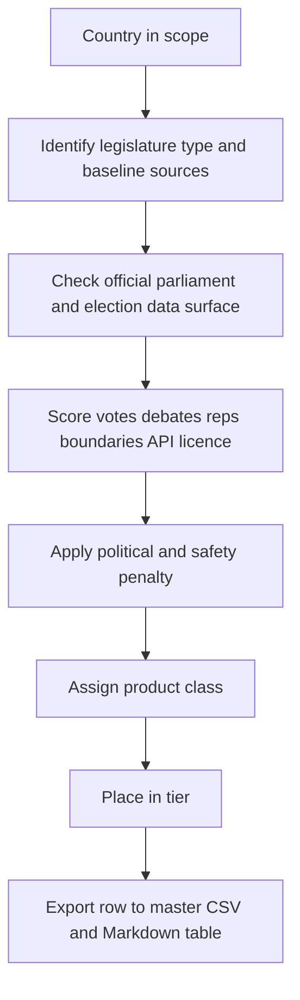

# Global feasibility of MyGov-style civic-transparency apps

## Executive summary

Your brief defines a MyGov-style product as a source-linked civic-transparency app that combines representative lookup, voting records, speeches or debates, constituency mapping, AI explanations, and map-led visualisation. fileciteturn0file0

The core conclusion is that a **global MyGov builder-agent is feasible only as a country-adapter factory**, not as a universal one-click generator. The reason is simple: the gap between countries is not just language. It is the underlying public-data plumbing. Some legislatures publish member records, roll-call votes, debates, and boundary files through stable APIs with explicit reuse terms; others still expose little more than PDFs, fragile search pages, or politically risky pseudo-transparency. IPU Parline is a strong global starting point because it aggregates parliamentary structure data for 193 countries, offers an API for countries, parliaments, chambers, elections, people, and political parties, and says its dataset contains more than 600 data points supplied directly by national parliaments. Freedom House’s 2026 methodology covers 195 countries and 13 territories, RSF’s 2026 index ranks 180 countries across political, economic, legal, sociocultural, and security indicators, and V-Dem’s 2026 release adds a high-quality democracy dataset with multiple democracy principles. citeturn4view0turn5view0turn15view0turn18view0turn55view0turn57view0

Using the rubric you specified, applied conservatively with **Unknown fields receiving no positive credit**, the resulting global distribution is:

| Feasibility tier | Count |
|:--|--:|
| Ready/Pilot | 19 |
| Buildable with effort | 31 |
| Research needed | 64 |
| Poor fit | 40 |
| Do-not-build | 41 |

The strongest cluster is what you would expect if parliamentary data had a LinkedIn profile: **Westminster-derived systems, Nordics, Benelux, Germany, and a handful of high-capacity democracies in Latin America and Oceania**. The weakest environments are concentrated in countries with one or more of the following: absent or non-verifiable roll-call records, no stable rep-to-district join, unclear reuse terms, suspended or non-competitive legislatures, and high political or personal-safety risk. Freedom House’s 2026 country-scores page makes the broad political pattern visible at a glance, while RSF and V-Dem help distinguish “messy democracy with usable records” from “formal legislature, unsafe civic-tech environment.” citeturn18view0turn19view0turn21view0turn57view0

The **best first non-UK adapter target is Canada**. It is close enough to the UK’s parliamentary logic to minimise schema drift, but different enough to force the adapter model to prove itself. The House of Commons open-data portal explicitly exposes machine-readable member, vote, Hansard, bill, committee, petition, and constituency datasets, and describes its open-data model as structured, machine-readable, reusable data. citeturn54view0turn54view1turn54view2turn54view3

## Scoring rubric

I used the weighting model you asked for, with one conservative implementation choice: **Unknown received zero positive credit**. That keeps the table sceptical rather than flattering.

| Component | Weight | Scoring rule used |
|:--|--:|:--|
| Roll-call votes | 25% | Yes = 25, Partial = 12.5, No/Unknown = 0 |
| Debates / transcripts | 20% | Yes = 20, Partial = 10, No/Unknown = 0 |
| Representative profiles | 15% | Yes = 15, Partial = 7.5, No/Unknown = 0 |
| Boundary data | 15% | Electoral boundaries available = 15, Administrative only = 7.5, No/Unknown = 0 |
| Official API / bulk downloads | 10% | Yes = 10, Partial = 5, No/Unknown = 0 |
| Licence clarity | 10% | Clear/Open = 10, Restrictive = 2, Unknown = 0 |
| Safety penalty | up to -25 | Low = 0, Medium = -8, High = -16, Extreme = -25 |

The tier boundaries used for the global ranking were:

| Score band | Tier |
|:--|:--|
| 75–100 | Ready/Pilot |
| 50–74 | Buildable with effort |
| 30–49 | Research needed |
| 15–29 | Poor fit |
| 0–14 | Do-not-build |

For the three example countries, the evidence base is relatively strong. The UK Parliament developer hub states that parliamentary data is publicly shared through open APIs under the Open Parliament Licence. Canada’s House of Commons open-data portal explicitly lists reusable machine-readable datasets for MPs, votes, Hansard, committee evidence and constituencies. India’s Digital Sansad clearly exposes official member and business interfaces for both houses, but the review did not verify a comparably clean official parliamentary API or bulk-download layer on the same day. Brazil’s Chamber of Deputies open-data portal explicitly offers a REST API and bulk files in CSV, JSON and XML, including deputies and per-parliamentarian voting files; the Senate also maintains an official open-data portal. Freedom House’s 2026 scores page reinforces the risk spread across the three cases: UK 92/100 Free, Brazil 73/100 Free, India 62/100 Partly Free. citeturn24view0turn54view0turn54view1turn54view2turn54view3turn32view0turn32view1turn58view0turn58view3turn30view1turn19view0turn18view0

| Country | Votes | Debates | Reps | Boundaries | API / bulk | Licence | Risk penalty | Example score | Interpretation |
|:--|:--|:--|:--|:--|:--|:--|--:|--:|:--|
| United Kingdom | Yes | Yes | Yes | Electoral boundaries available | Yes | Clear/Open | 0 | 95 | Gold-standard template country |
| India | Partial | Yes | Yes | Unknown | Unknown | Unknown | -8 | 40 | Good institutional surface area, but machine-readable plumbing still patchy |
| Brazil | Partial | Yes | Yes | Electoral boundaries available | Yes | Unknown | -8 | 65 | Strong build candidate, with normalisation and governance work still needed |

## Global findings

The biggest single differentiator was **not** whether a country is democratic in the abstract. It was whether a citizen-facing product can reliably join five things together: person, chamber activity, vote, speech, and district. IPU tells you the parliamentary skeleton; the national parliament site tells you whether there is actual flesh on the bones. In countries such as the UK, Canada, Sweden, Norway, Germany and the Netherlands, the official layer already exposes enough structured data to avoid the “heroic scraper plus vibes” trap. The UK has a public API directory with member, Commons votes, Lords votes, bills and question APIs under an explicit parliamentary licence; Sweden’s Riksdag provides APIs and datasets for documents, members, votes and speeches and says the data may be used freely with attribution; Norway’s Storting makes votes, representatives, meetings, questions and hearings reusable through open datasets and API/XML access; Germany exposes machine-readable plenary protocols, printed papers, member biographies and named-vote lists; and the Dutch Tweede Kamer’s official portal offers both OData JSON and SyncFeed XML interfaces. citeturn24view0turn26view0turn27view0turn29view1turn29view2turn40view0

The middle band is more interesting than the top band. Countries like Brazil, Japan, South Korea, South Africa, Mexico, Argentina, Colombia, Spain and Italy are often buildable, but not yet pleasantly buildable. The records exist, but entity resolution, language, terms of reuse, or geography joins still need elbow grease. Brazil is a good illustration: the Chamber of Deputies offers a REST API and large bulk files in CSV/JSON/XML, including deputies and vote-per-parliamentarian records, while the Senate maintains its own open-data portal. That is enough to build something serious; it is just not yet the sort of neat, single-pipe developer experience that makes onboarding feel like cheating. citeturn30view0turn58view0turn58view3turn30view1

The bottom band splits into two very different problems. **Poor fit** countries generally have some usable public surface area but too many gaps or too much legal and technical friction. **Do-not-build** countries are different: the issue is not only missing data, but also citizen-safety, defamation exposure, press constraints, suspended legislatures, or official records that cannot be trusted as a basis for accountability tooling. Freedom House’s 2026 materials show a twentieth consecutive year of global decline, and RSF’s 2026 index makes the media-safety dimension impossible to ignore. When both polity and media conditions are harsh, a civic-explainer app stops being just a product problem and becomes a user-risk problem. citeturn15view0turn22view1turn55view0turn21view0

The map below is generated directly from the report dataset. Tiny microstates are hard to see at world scale, but the regional pattern is still useful.

[Download the SVG world map](sandbox:/mnt/data/mygov_feasibility_map.svg)

## Primary deliverables

The complete one-row-per-country table is provided in machine-readable form here:

| Deliverable | Link |
|:--|:--|
| Master CSV | [mygov_feasibility_2026-05-28.csv](sandbox:/mnt/data/mygov_feasibility_2026-05-28.csv) |
| Full Markdown table | [mygov_feasibility_table.md](sandbox:/mnt/data/mygov_feasibility_table.md) |
| Top-50 Markdown table | [mygov_top50.md](sandbox:/mnt/data/mygov_top50.md) |
| PNG map | [mygov_feasibility_map.png](sandbox:/mnt/data/mygov_feasibility_map.png) |
| SVG map | [mygov_feasibility_map.svg](sandbox:/mnt/data/mygov_feasibility_map.svg) |

The CSV is the primary deliverable. It contains the fields you requested for **all 195 sovereign states in scope**: 193 UN member states plus the Holy See and the State of Palestine. IPU’s current parliamentary dataset covers 193 countries, and the UN General Assembly currently has two non-member observer states. citeturn4view0turn10search6

A key interpretive point: for long-tail countries, **Unknown means “not verified from an authoritative source in this review”, not “proven absent”**. That distinction matters. It is the difference between “no evidence of a pipe” and “evidence there is no pipe”. The table is intentionally conservative because a builder-agent that hallucinates data infrastructure is not a builder-agent; it is a very expensive intern.

## Top fifty countries

The ranked top 50 from the scoring model are:

| Country | Score | Tier |
|:--|--:|:--|
| Canada | 95 | Ready/Pilot |
| Norway | 95 | Ready/Pilot |
| Sweden | 95 | Ready/Pilot |
| United Kingdom | 95 | Ready/Pilot |
| Australia | 88 | Ready/Pilot |
| Denmark | 88 | Ready/Pilot |
| Estonia | 88 | Ready/Pilot |
| Finland | 88 | Ready/Pilot |
| Germany | 88 | Ready/Pilot |
| Ireland | 88 | Ready/Pilot |
| Netherlands | 88 | Ready/Pilot |
| New Zealand | 88 | Ready/Pilot |
| Austria | 78 | Ready/Pilot |
| Chile | 78 | Ready/Pilot |
| Czechia | 78 | Ready/Pilot |
| Iceland | 78 | Ready/Pilot |
| Portugal | 78 | Ready/Pilot |
| Slovenia | 78 | Ready/Pilot |
| Switzerland | 78 | Ready/Pilot |
| Brazil | 65 | Buildable with effort |
| Argentina | 60 | Buildable with effort |
| Belgium | 60 | Buildable with effort |
| Botswana | 60 | Buildable with effort |
| Cabo Verde | 60 | Buildable with effort |
| Colombia | 60 | Buildable with effort |
| Costa Rica | 60 | Buildable with effort |
| Croatia | 60 | Buildable with effort |
| Cyprus | 60 | Buildable with effort |
| France | 60 | Buildable with effort |
| Greece | 60 | Buildable with effort |
| Hungary | 60 | Buildable with effort |
| Israel | 60 | Buildable with effort |
| Italy | 60 | Buildable with effort |
| Japan | 60 | Buildable with effort |
| Latvia | 60 | Buildable with effort |
| Lithuania | 60 | Buildable with effort |
| Mauritius | 60 | Buildable with effort |
| Mexico | 60 | Buildable with effort |
| Mongolia | 60 | Buildable with effort |
| Namibia | 60 | Buildable with effort |
| Poland | 60 | Buildable with effort |
| Republic of Korea | 60 | Buildable with effort |
| Romania | 60 | Buildable with effort |
| Slovakia | 60 | Buildable with effort |
| South Africa | 60 | Buildable with effort |
| Spain | 60 | Buildable with effort |
| United States of America | 60 | Buildable with effort |
| Uruguay | 60 | Buildable with effort |
| Panama | 53 | Buildable with effort |
| Peru | 53 | Buildable with effort |

The top band is not just rich-country bias. It is **data-shape bias**. The countries that won are the ones where official institutions already think in entities and exports: members, votes, speeches, bills, committees, districts, and machine-readable feeds.

The five best first international pilots **after the UK** are:

| Pilot | Why it fits | Likely MVP | Main blocker |
|:--|:--|:--|:--|
| Canada | Westminster logic, official votes, Hansard, member and constituency feeds | MP profile, vote explorer, Hansard summaries, riding pages | bilingual content handling and House/Senate normalisation |
| Sweden | exceptionally strong official open-data surface | speech explorer, vote explorer, member pages | non-English NLP and terminology mapping |
| Norway | deep official open-data service with reusable parliamentary records | representative lookup, votes, questions, hearings | language and entity normalisation |
| Netherlands | official OData and SyncFeed APIs | member, motion, debate and committee explorer | bicameral stitching and Dutch terminology |
| Australia | strong geography plus mature civic-tech ecosystem | division map, MP pages, speeches, votes | dependence on mixed official plus civic-tech data layers |

The evidence for those pilot choices is unusually solid. Canada’s Commons portal exposes machine-readable member, vote, Hansard and constituency feeds. Sweden’s Riksdag says its API and datasets cover documents, members, votes and speeches, and may be reused freely with attribution. Norway’s Storting explicitly offers downloadable datasets and API access for representatives, votes, questions, meetings, hearings and publications. The Dutch Tweede Kamer’s official portal provides both JSON OData and XML SyncFeed APIs. Australia’s AEC publishes current federal electoral boundaries in shapefile form, while OpenAustralia exposes a mature parliamentary API and documents its licensing position clearly. citeturn54view0turn54view1turn54view2turn54view3turn26view0turn27view0turn40view0turn37view1turn39view0

## Adapter architecture recommendation

A reusable architecture should not start from pages. It should start from **portable entities**. Conveniently, IPU’s API entities already point in the right direction: country, parliament, chamber, election, people and political party. citeturn5view0

The schema I would use is a **Popolo-like parliamentary core** with adapter-specific extensions:

| Core object | Minimum fields |
|:--|:--|
| Person | stable ID, official name, aliases, gender if published, party, chamber memberships, contact links, source links |
| Membership | person ID, chamber ID, party, seat status, start/end dates |
| Chamber | legislature, house type, term, official source |
| District | district ID, official name, geometry source, boundary validity dates |
| Bill / Motion | official ID, title, status, sponsors, chamber, dates, source links |
| Vote / Division | vote ID, motion ID, chamber, date, result, per-member votes where available |
| Speech / Intervention | event ID, speaker ID, chamber, timestamp, text or transcript fragment, source URL |
| Committee | committee ID, memberships, inquiries, reports |
| Question | written or oral question ID, asker, respondent, dates, answer text |
| Source | URL, publisher, retrieval date, licence, language, confidence |
| Caveat file | legal, political, linguistic and matching caveats per country |

That architecture supports the adapter model you asked for in the brief: **representative adapter, vote adapter, speech adapter, geography adapter, source-link adapter, terminology dictionary, local political caveat file, and risk profile**. fileciteturn0file0

The direct answers to your five end-state questions are straightforward:

| Question | Answer |
|:--|:--|
| Is a global MyGov builder-agent feasible? | Yes, but only as a controlled adapter framework with explicit country eligibility gates |
| Which countries should be supported first? | After the UK: Canada, Sweden, Norway, Netherlands, Australia |
| What common data schema should be used? | Popolo-like people/membership core plus first-class vote, speech, district, source and licence objects |
| What should the first country-adapter prototype target? | Canada |
| What should be avoided? | Extreme-risk states, suspended legislatures, unclear legal reuse, and any build that cannot preserve source-linked provenance |

The thing to avoid is false universality. A good builder-agent should be able to say **“not yet”** or **“do not build here”** with the same confidence it says **“here is your MVP scaffold”**.

## Methodology appendix

Coverage was limited to sovereign states in the scope you specified: **193 UN member states plus the Holy See and the State of Palestine**. Dependent territories were excluded. Parliamentary structure came primarily from IPU Parline and its API; political and safety context came primarily from Freedom House 2026, with RSF 2026 and V-Dem 2026 used as secondary democracy and media-freedom proxies. High-confidence feature verification was then done manually on a smaller core of official parliamentary or electoral-data sites, especially for countries likely to land in the top tiers. citeturn4view0turn5view0turn15view0turn18view0turn21view0turn57view0

Manual checks were strongest for the countries that matter most for product sequencing. The UK developer hub explicitly lists public parliamentary APIs under the Open Parliament Licence. Canada’s Commons portal documents member, vote, Hansard, committee and constituency feeds. Sweden, Norway, Germany and the Netherlands each have official open-data portals or machine-readable parliamentary interfaces. India and Brazil were included in the example-calculation set precisely because they sit on opposite sides of the “high-potential but messy” line: India has visible official parliamentary interfaces but weaker verified machine-readable plumbing from the pages reviewed; Brazil has much stronger official API and bulk-download evidence. citeturn24view0turn54view0turn54view1turn54view2turn54view3turn26view0turn27view0turn29view1turn29view2turn40view0turn32view0turn32view1turn58view0turn58view3turn30view1

### Research timeline

### Scoring pipeline

### Open questions and limitations

The lower-confidence rows are **directional**, not final procurement-grade judgements. I manually validated the highest-priority countries and a representative set of edge cases, but I did not perform chamber-by-chamber primary-source verification for every single sovereign state. In those long-tail cases, the table is still useful, but it should be read as a portfolio triage instrument, not as a legal opinion or a claim that no better local data exists.

A second limitation is country-level granularity. Federal systems can look better or worse depending on whether you care about national legislatures only or also subnational ones. The US is the obvious example: a national MVP is buildable, but a truly MyGov-like nationwide experience would become much stronger if federal and state-level adapters were allowed to coexist.

A third limitation is that **official source quality and civic-tech source quality do not always point in the same direction**. Australia is a good example: official boundary data is very strong, while some of the easiest parliamentary developer surfaces are in the civic-tech layer, and those come with licence nuances that need care. OpenAustralia’s API is valuable, but it also documents that some parliamentary material it uses is under a Creative Commons Attribution-NonCommercial-NoDerivs licence, while its own data is under CC BY-SA. That is manageable, but only if the adapter keeps provenance and licensing metadata at field level. citeturn39view0turn37view1

The last limitation is the important one: some countries should not be product targets even if you can technically scrape them. A legislature page is not a moral permission slip. Where repression, media hostility, or institutional collapse are severe, the right output is sometimes **“do not build”**, full stop. citeturn15view0turn21view0turn57view0